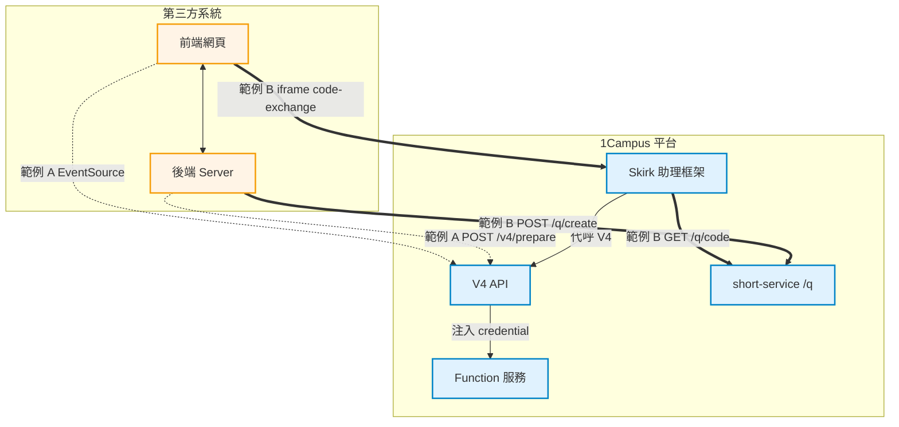

# 1Campus GPT 範例

第三方整合 V4 API / Skirk 的最小可運作範例。

## 範例列表

| 目錄 | 主題 | 重點 |
|------|------|------|
| [`v4-streaming/`](./v4-streaming/) | V4 API 二階段串流 | 後端藏 API Key + 前端 EventSource 接 SSE |
| [`skirk-embed/`](./skirk-embed/) | Skirk Code Exchange + iframe | 安全傳送使用者身份 + iframe 嵌入 |

## 共通設定

- 兩個範例都以 prod preset `preset_zle7gp7k`（成績查詢助理）為 demo 目標
- Function `query_scores` 的 access token 是公開 demo 值：`sk-score-7f3a9c2e1b7d40568faec3119d2b6e84`（後端為假資料）
- 兩個範例的 port 不衝突（`3001` / `3002`），可同時跑

## 為什麼要看這些範例

| 你想做的事 | 看哪個 |
|-----------|--------|
| 自己 server-to-server 呼叫 V4 API，前端要串流顯示 | `v4-streaming/` |
| 把 Skirk 助理嵌進自家網頁，且要帶使用者身份 | `skirk-embed/` |

## 全局架構

兩個範例與 1Campus 平台的元件關係：

**線條說明**：
- 🔸 虛線 = 範例 A（`v4-streaming/`）：直接呼叫 V4 API
- 🔹 粗線 = 範例 B（`skirk-embed/`）：透過 Skirk 包裝，使用者經 iframe 進入

## 共通的 Preset

兩個範例最終都打到同一個 preset `preset_zle7gp7k`（成績查詢助理），function `query_scores` 透過 `credentialRouting` 注入 `X-Access-Token` 完成認證。

## 延伸閱讀

- [`credential-passthrough.md`](./credential-passthrough.md) — 兩個範例如何透過 credential 透傳機制把 access token 帶到 function endpoint
