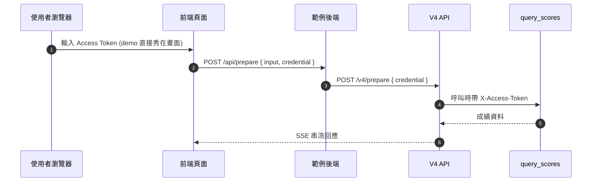
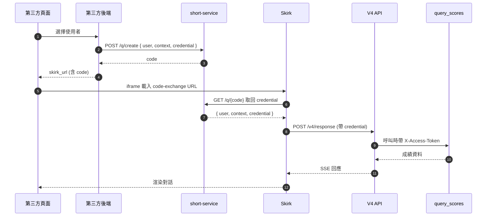

# Credential 透傳 — 兩個範例怎麼用

本文件說明 `v4-streaming/` 與 `skirk-embed/` 兩個範例如何透過 V4 的 credential 透傳機制，把使用者 access token 帶到 function endpoint。

> **規格與完整 API 說明請看官方文件**：
> - Function 端 `credentialRouting` 設定 → [credential-routing.md](../references/credential-routing.md)
> - Caller 端 `credential` 欄位 → [request.md#credential](../references/request.md#credential)
>
> 本文件只講「在這兩個範例中，credential 從哪裡來、到哪裡去」。

---

## 共通設定：`query_scores` function

兩個範例的 preset 都掛了 `query_scores` function，其 `credentialRouting`：

```json
{
  "accessToken": { "location": "header", "path": "X-Access-Token" }
}
```

意思是：caller 傳 `credential.accessToken` → V4 呼叫 `query_scores` 時自動加上 `X-Access-Token: <值>`。

Function 端實作見 `src/service/functions.ts`（demo 版固定驗證一個 token，正式應用會依 token 識別使用者）。

---

## 範例 A：`v4-streaming/`

caller 是「第三方後端 + 瀏覽器前端」，credential 由前端輸入後經後端透傳：



**重點**：
- 範例為了 demo 方便，access token 由瀏覽器輸入
- **實務上應由後端依登入 session 組裝 credential**，不該讓前端拿到 raw token
- 程式碼位置：`v4-streaming/server.js` line 34、44-46 透傳 `credential` 給 `/v4/prepare`

---

## 範例 B：`skirk-embed/`

caller 是「第三方後端」，credential 透過 short-service code 安全傳給 Skirk，使用者全程看不到 token：



**重點**：
- 真實 access token 全程在 server ↔ server 之間流動
- 使用者只看到無意義的 `code` 在 iframe URL 上
- 程式碼位置：`skirk-embed/server.js` line 29-45 的 `FAKE_USERS` 結構展示 `{ user, context, credential }` 三件套

---

## 兩個範例的差異一句話

| 範例 | Credential 從哪來 | 風險 |
|------|------------------|------|
| `v4-streaming/` | 前端輸入框（demo 簡化）| Token 暴露在瀏覽器 — **僅供教學** |
| `skirk-embed/` | 後端依 session 組裝後丟 short-service | Token 只在 server ↔ server — **production 模式** |

---

## 系統自動注入 `__user`

V4 會把 request 的 `user` 欄位自動寫進 `credential.__user`，function 端可在 `credentialRouting` 直接取用，不需 caller 自己傳。詳見 [credential-routing.md#系統自動注入欄位](../references/credential-routing.md#系統自動注入欄位)。

兩個範例目前沒用到這欄位，但未來 `query_scores` 要做 per-user 授權時，可以直接：

```json
{
  "credentialRouting": {
    "__user": { "location": "header", "path": "X-Caller-User" }
  }
}
```
