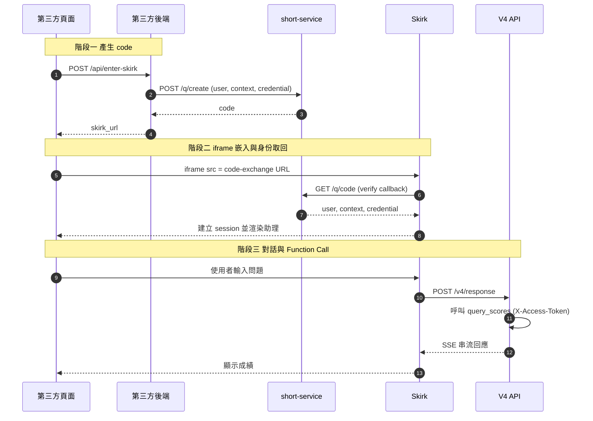

# Skirk Code Exchange — iframe 嵌入範例

模擬第三方系統「以已登入使用者身份進入 AI 助理」的安全流程，並用 iframe 嵌入到自家網頁。

## 為什麼用 code_exchange？

第三方系統有自己的使用者，需要把使用者身份（含個人 access token）安全地傳給 Skirk，但又不能把 token 暴露在 URL。

`code_exchange` 流程：
- 第三方後端把身份資料存到 short-service（或自家 verify endpoint），換取一次性 **code**
- 使用者只看到 code（無意義字串），看不到真實身份
- Skirk 後端 server-to-server 用 code 取回真實身份，再建立 session

token 全程在 server ↔ server 之間，不會出現在 URL / referer / log。

## Skirk App 設定

在管理介面把 `skirk_gdeuboao` 的「認證設定」改為：

```json
{
  "auth_mode": "code_exchange",
  "verify_url": "https://1campus.net/q/{{code}}",
  "verify_method": "GET"
}
```

> 範例借用 `1campus.net/q/*` short-service 當 code 儲存中介；外部第三方也可以自己架 verify endpoint，回傳格式相同即可。

## 啟動

```bash
npm install
node server.js
```

打開 <http://localhost:3002>。

## 環境變數

| 變數 | 必填 | 預設 | 說明 |
|------|------|------|------|
| `SKIRK_ASSISTANT` | | `skirk_gdeuboao` | Skirk App 的 assistant code |
| `SKIRK_BASE` | | `https://gpt.1campus.net` | Skirk 服務位址 |
| `PORT` | | `3002` | 本地 server 埠號 |

## 流程



## 重點觀察

1. **使用者只看到 code**（在 iframe src 的 URL 上），完全看不到 user / accessToken
2. **真實身份** 透過 server-to-server callback 取回
3. **AI function call** 拿到 `credential.accessToken` 後注入 `X-Access-Token` header 呼叫 `query_scores`
4. **iframe 沒被擋**：已驗證 Skirk 入口沒設 `X-Frame-Options` / `CSP frame-ancestors`

## 測試話題

進入後可以問：
- 「我 5 月數學考幾分？」（觸發 query_scores function call）
- 「你是誰？認識我嗎？」（驗證 context 是否注入）
