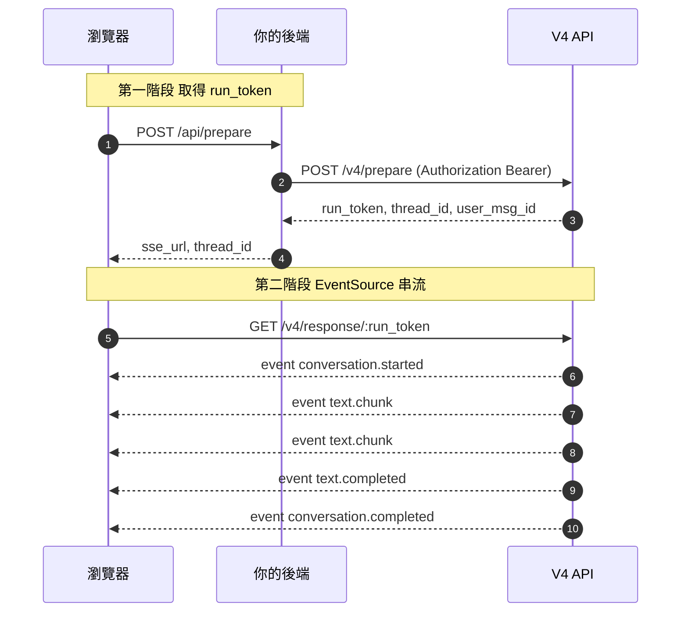

# 1Campus GPT V4 API — 二階段範例

最小可運作的 V4 API 串流範例，示範**正確的前後端分工**：

- **後端** (`server.js`)：藏 API Key，呼叫 `/v4/prepare` 取得 `run_token`
- **前端** (`index.html`)：用 `EventSource` 連 `/v4/response/:run_token` 接 SSE 串流

## 為什麼要二階段？

瀏覽器的 `EventSource` 無法傳 `Authorization` Header，且 `POST /v4/response` 是 server-to-server 設計（未開 CORS）。

二階段 API 專為瀏覽器設計：
- `POST /v4/prepare` — 需 API Key，從後端打
- `GET /v4/response/:run_token` — 不需 Key，前端可直接打（有開 CORS）

## 啟動

```bash
npm install
V4_API_KEY=prj_xxx.key_yyy node server.js
```

打開 <http://localhost:3001>。

## 環境變數

| 變數 | 必填 | 預設 | 說明 |
|------|------|------|------|
| `V4_API_KEY` | ✅ | — | Project API Key，格式 `prj_xxx.key_yyy` |
| `PRESET_CODE` | | `preset_zle7gp7k` | 要呼叫的 preset code |
| `V4_BASE` | | `https://gpt.1campus.net` | V4 API 服務位址 |
| `PORT` | | `3001` | 本地 server 埠號 |

## Function Call 認證（credential）

`query_scores` function 的 `credentialRouting` 設定為：

```json
{ "accessToken": { "path": "X-Access-Token", "location": "header" } }
```

意思是：caller 傳 `credential.accessToken`，V4 會把它放到呼叫 function endpoint 時的 `X-Access-Token` HTTP header。

範例做法：
- 前端頁面 header 區的「Access Token」input → 存在 `localStorage`
- 每次 `/api/prepare` 時前端傳給後端：`{ input, credential: { accessToken } }`
- 後端透傳給 `/v4/prepare`

## 流程


