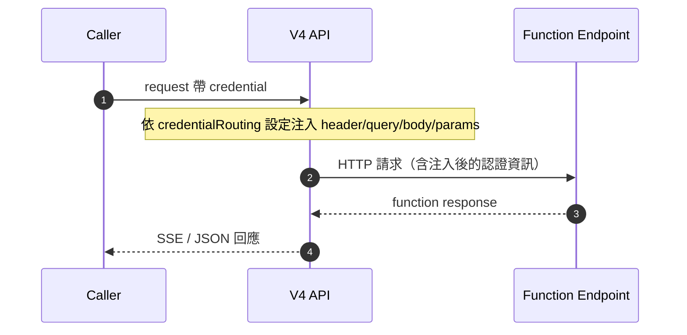

# Credential Routing 指南

**版本**: v4.2
**最後更新**: 2026-05-28
**適用對象**: Function 提供者、Preset 設計者、Caller 開發者

---

## 概述

Credential Routing 是 V4 在呼叫 function endpoint 時，把 caller 傳入的 `credential` 欄位**自動注入到 HTTP 請求**的機制。Caller 不需要、也不應該直接呼叫 function endpoint，而是把認證資訊交給 V4，由 V4 依 function 端的設定路由到正確位置（header / query / body / params）。

### 為什麼需要

- Function endpoint 通常需要 per-user / per-token 認證
- Caller（瀏覽器或第三方後端）不應直接接觸 function endpoint
- 認證資訊散落在請求各處（Authorization header、query token、body field…），需要統一的宣告式機制

### 整體鏈路



Caller 端：傳 [`credential`](./request.md#credential)
Function 端：宣告 `credentialRouting`（本文件）

---

## Function 端設定

Function `implementation` 物件中可宣告 `credentialRouting`：

```typescript
{
  url: string;
  method?: string;
  credentialRouting?: Record<string, RoutingConfig>;
  routing?: Record<string, RoutingConfig>;        // AI 參數
  contextRouting?: Record<string, RoutingConfig>; // context 變數
  defaultHeaders?: Record<string, string>;
  defaultBody?: Record<string, any>;
}
```

`credentialRouting` 的 key 對應 caller 傳入 `credential[key]` 的欄位名，value 是 `RoutingConfig`。

### RoutingConfig 規格

| 欄位 | 型別 | 必填 | 說明 |
|------|------|------|------|
| `location` | `"header" \| "query" \| "body" \| "params"` | ✅ | 注入位置 |
| `path` | `string` | | 目標欄位名/路徑；未指定時用 routing key |
| `representation` | `"json" \| "string"` | | 僅 body 用；`"string"` 會 `JSON.stringify` |
| `prefix` | `string` | | 僅 header 用，例如 `"Bearer "` |
| `encoding` | `"none" \| "base64"` | | 僅 header 用 |

### `path` 語法（依 location 而異）

| location | `path` 語意 | 範例 |
|----------|-------------|------|
| `header` | HTTP Header 名稱 | `"Authorization"`、`"X-Access-Token"` |
| `query` | Query string key | `"token"` |
| `body` | lodash `set` 路徑；`"$"` 代表整個 body | `"auth.token"`、`"$"` |
| `params` | URL 上的 `:xxx` 名稱 | `"userId"`（會替換 `/users/:userId`）|

---

## 四種注入方式範例

### 1. Header（最常見）

```json
{
  "credentialRouting": {
    "accessToken": { "location": "header", "path": "X-Access-Token" }
  }
}
```

Caller 傳 `credential: { accessToken: "abc" }`，V4 呼叫 function 時帶上：

```
X-Access-Token: abc
```

### 2. Header + Bearer 前綴

```json
{
  "credentialRouting": {
    "token": { "location": "header", "path": "Authorization", "prefix": "Bearer " }
  }
}
```

`credential: { token: "eyJhbG..." }` → `Authorization: Bearer eyJhbG...`

### 3. Header + Basic Auth（base64）

```json
{
  "credentialRouting": {
    "basic": { "location": "header", "path": "Authorization", "prefix": "Basic ", "encoding": "base64" }
  }
}
```

`credential: { basic: "user:pass" }` → `Authorization: Basic dXNlcjpwYXNz`

### 4. Query / Body / Params

```json
{
  "credentialRouting": {
    "apiKey":  { "location": "query",  "path": "api_key" },
    "session": { "location": "body",   "path": "auth.session" },
    "userId":  { "location": "params", "path": "userId" }
  }
}
```

| 輸入 | 結果 |
|------|------|
| `credential.apiKey = "k1"` | URL 加上 `?api_key=k1` |
| `credential.session = "s1"` | body 設定 `{ auth: { session: "s1" } }` |
| `credential.userId = "u1"` | URL `/users/:userId` → `/users/u1` |

---

## 系統自動注入欄位

V4 會在 caller 傳入的 `credential` 上自動合併系統保留欄位（以 `__` 前綴），function 端可直接在 `credentialRouting` 取用，**不需 caller 自行傳**：

| 欄位 | 型別 | 來源 |
|------|------|------|
| `__user` | `string \| null` | request 的 [`user`](./request.md#user) 欄位 |

**注意**：`__` 前綴為系統保留命名空間，caller 傳入同名欄位會被**強制覆蓋**。

範例：function 想拿到呼叫者身份做 per-user 授權，不需要要求 caller 重複傳：

```json
{
  "credentialRouting": {
    "__user": { "location": "header", "path": "X-Caller-User" }
  }
}
```

---

## 與 `routing` / `contextRouting` 的差異

V4 共有三種 routing，使用同一份 `RoutingConfig` 語法，但資料來源不同：

| Routing | 來源 | 用途 |
|---------|------|------|
| `routing` | AI 產生的 function arguments | 把 AI 決定的參數送進 endpoint |
| `credentialRouting` | Caller request 的 `credential` | 注入認證資訊 |
| `contextRouting` | Caller request 的 `context` | 注入使用者上下文（學校、班級…）|

三者會依序處理同一個 HTTP 請求（params → query → body → header），互不衝突。同一個 key 在不同 routing 各自獨立。

---

## 行為細節

- **空值跳過**：`credential[key] === undefined` 時不注入該欄位，不會報錯
- **未設定 routing 的 credential 欄位會被忽略**：caller 傳了 `credential.foo` 但 function 沒宣告 `foo`，該欄位不會出現在 function 請求中
- **不寫入持久化資料**：`credential` 內容不會寫進 thread / messages，也不會出現在 SSE 的對話事件中（僅在 diagnostic 事件記錄被注入的 key 名，不含值）
- **每次 request 獨立**：`credential` 不會跨 thread 沿用，每次 caller 都要重新傳

---

## Caller 端使用

Request body 加上 `credential` 欄位即可，完整規格見 [`request.md#credential`](./request.md#credential)：

```json
{
  "name": "preset_xxx",
  "input": "我這個月數學考幾分？",
  "credential": {
    "accessToken": "sk-student-abc123"
  }
}
```

二階段 API 在 `/v4/prepare` 階段傳 `credential`，會被保留到 `/v4/response/:run_token` 執行時使用。

---

## 安全建議

- **Caller 端**：`credential` 內容應由**後端**組裝後再呼叫 V4，不要在瀏覽器組
- **Function 端**：仍需自行驗證 token 有效性，V4 只負責「把 caller 送的值搬到指定位置」，不做驗證
- **API Key vs Credential**：V4 的 API Key（`Authorization: Bearer prj_xxx.key_yyy`）認證 caller 身份；`credential` 認證 function endpoint 的呼叫權限，兩者用途不同

---

## 相關文件

- [Request 規格 — credential 欄位](./request.md#credential)
- [Context 模板](./context-template.md)（`contextRouting` 的使用情境）
